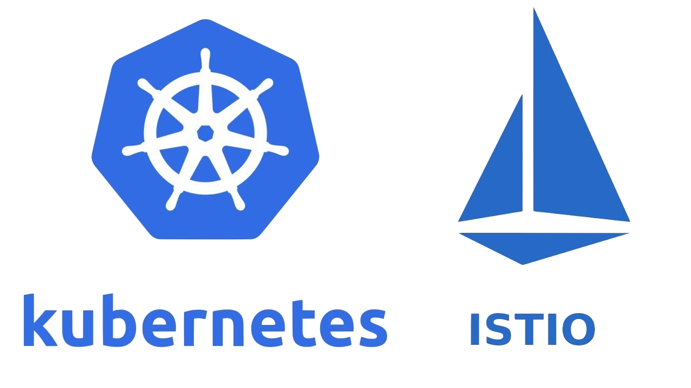

<h1 align="center">DevOps - Kubernetes e Istio</h1>

  
  

  <a href="#-projeto">Projeto</a>&nbsp;&nbsp;&nbsp;|&nbsp;&nbsp;&nbsp;
  <a href="#-tecnologias">Tecnologias</a>&nbsp;&nbsp;&nbsp;|&nbsp;&nbsp;&nbsp;
  <a href="#-ambiente">Ambiente</a>&nbsp;&nbsp;&nbsp;|&nbsp;&nbsp;&nbsp;
  <a href="#-licença">Licença</a>&nbsp;&nbsp;&nbsp;|&nbsp;&nbsp;&nbsp;
  <a href="#-referências">Referências</a>

  

## 🌱 Projeto

- Projeto para estudar o gerenciamento de tráfego de dados dentro de um cluster kubernetes utilizando o Istio.

## ✨ Tecnologias

- Kubespray
- Kubernetes
- Istio
- Prometheus
- Kiali
- Grafana
- Haproxy
- Vagrant
- Virtualbox
- Ansible

## 🚀 Ambiente

0. [Levantar um balanceador Haproxy](/balanceador/Readme.md)
1. [Criar chaves ssh para o projeto](/keys/Readme.md)
2. [Criar um hosts virtuais com vagrant e virtualbox](/vagrant/Readme.md)
3. [Criar um cluster kubernetes com Kubespray](/kubespray/kubespray.md)
4. [Configurações iniciais no cluster](/k8s/Readme.md)
5. [Download e instalação do istio](/istio/Readme.md)
6. [Instalação de alguns addons para ajudar no entendimento, estrutura e integridade da malha](https://istio.io/latest/docs/ops/integrations/)
7. [Criar, conteinerizar e publicar imagens nginx para ser utilizado no deploy da demonstração de tráfego com istio](/app/Readme.md)
8. [Praticando Gerenciamento de tráfego com o Istio](/istio/pratica.md)

## 📄 Licença

Esse projeto está sob a licença MIT. Veja o arquivo [LICENSE](LICENSE) para mais detalhes.

## 🙇 Referências

- [Getting Started Istio](https://istio.io/latest/docs/setup/getting-started/)

- [Installation Configuration Profiles](https://istio.io/latest/docs/setup/additional-setup/config-profiles/)

- [Addons Istio](https://istio.io/latest/docs/ops/integrations/)

