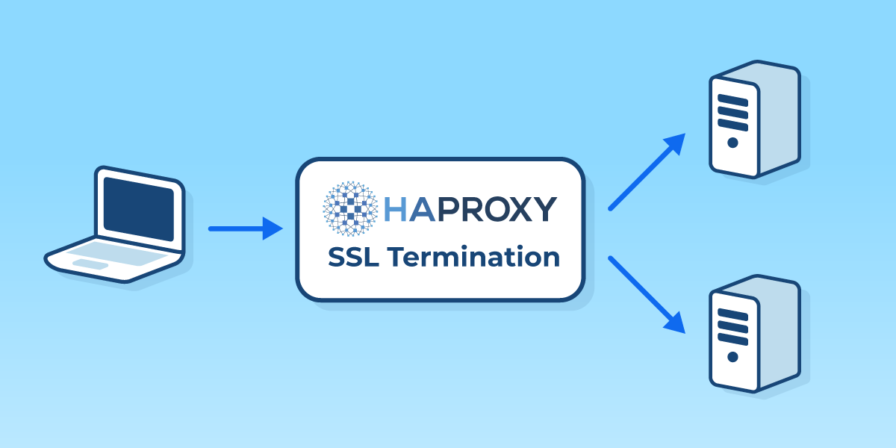
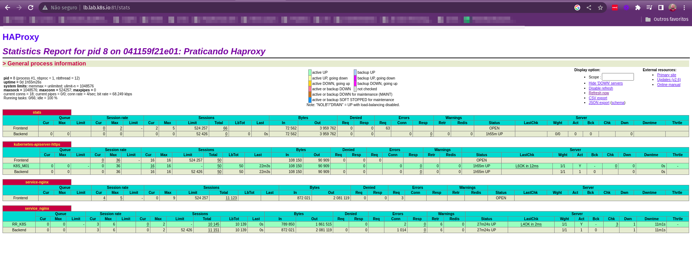

<h1 align="center">Balanceador Haproxy</h1>

<p align="center">
  
</p>


## Etapas

- Criação de um docker-compose para subir um balanceador haproxy

  ```yaml
  version: "3.6"
  services:
      haproxy:
          image: haproxy
          env_file:
              - ./haproxy/haproxy.env
          volumes:
              - ./haproxy/haproxy.cfg:/usr/local/etc/haproxy/haproxy.cfg:ro
              - ./haproxy/abuse.lst:/usr/local/etc/haproxy/abuse.lst:ro
          ports:
              - "80:80"
              - "81:81"
              - "441:441"
              - "6443:6443"
              - "443:443"
              - "8081:8081"
  ```

- Aruivo de variáveis utilizadas

  - haproxy.env
  ```yaml
  #Global
  LOGGER=10.0.2.206

  #Listen Stats
  LISTEN=*
  STATS=enable
  STATSLP=admin:admin
  STATSURI=/stats
  STATSSHOW=Praticando Haproxy
  ABUSERS=/etc/haproxy/abuse.lst

  #Defaults
  TIMEOUT=50s
  
  #Listen Kubernetes-apiserver-https
  SERVER=192.168.50
  PORT_K8S=6443
  PORT_INGRESS_ISTIO=31987
  ```

- Criar arquivo de configuração haproxy
- Ativar dashboardo haproxy
- Adicionar o Cluster Kubernetes no haproxy
- Adicionar serviço nginx ao haproxy

  - haproxy.cfg

  ```yaml
  global
  # log "${LOGGER}:514" local0
      log /dev/log  local0
      log /dev/log  local1 notice
      user haproxy
      group haproxy
      daemon

  defaults
      log    global
      mode http
      timeout client "${TIMEOUT}"
      timeout server "${TIMEOUT}"
      timeout connect 5s

  listen stats
      bind "${LISTEN}:81"
      stats "${STATS}"
      # http-request rejeitar if { src -f "${ABUSERS}" }
      stats hide-version
      stats refresh 30s
      stats show-node
      stats auth "${STATSLP}"
      stats uri "${STATSURI}"
      stats show-desc "${STATSSHOW}"

  listen kubernetes-apiserver-https
      bind "${LISTEN}:6443"
      mode tcp
      option log-health-checks
      timeout client 3h
      timeout server 3h
      balance roundrobin
      server K8S_M01 "${SERVER}.11:${PORT_K8S}" check check-ssl verify none inter 2000

  frontend service-nginx
      mode http
      option log-health-checks
      bind "${LISTEN}:80"

      acl dns_nginx hdr(host) -i lab.k8s.io

      acl path_nginx path_beg -i /
      use_backend service_nginx if dns_nginx path_nginx

  backend service_nginx
      mode http
      option forwardfor
      balance leastconn
      server RR_K8S "${SERVER}.11:${PORT_INGRESS_ISTIO}" check 

  ```

<p align="center">
  
</p>

## Comandos

- Subindo o balanceador

```bash
docker-compose up -d
```

- Derrubando o balanceador

```bash
docker-compose down
```

- Restartando o balanceador

```bash
docker-compose restart
```