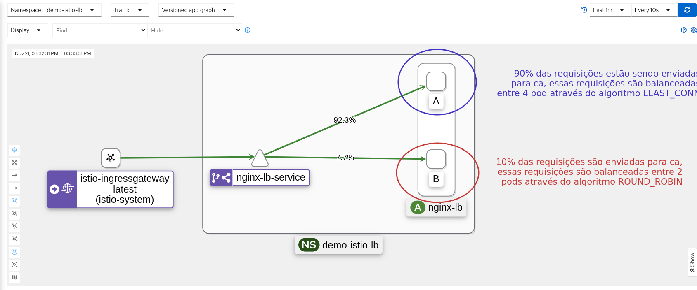
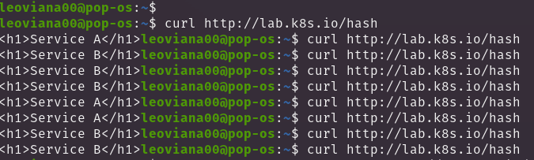
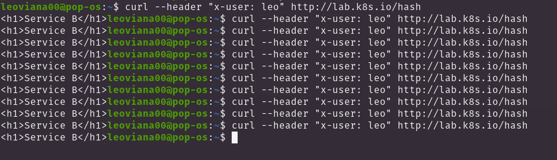

<h1 align="center">Istio</h1>

<p align="center">
  <a href="#instalação">Instalação</a>&nbsp;&nbsp;&nbsp;|&nbsp;&nbsp;&nbsp;
  <a href="#tráfego">Tráfego</a>&nbsp;&nbsp;&nbsp;|&nbsp;&nbsp;&nbsp;
  <a href="#componentes">Componentes</a>&nbsp;&nbsp;&nbsp;|&nbsp;&nbsp;&nbsp;
  <a href="#prática">Prática</a>
</p>

<p align="center">
  
</p>

## Instalação

- [Documentação Instalação do Istio](https://istio.io/latest/docs/setup/getting-started/)
    - Download Istio
    - Instalação do Istio
        - OBS: Adicione um rótulo de namespace para instruir o Istio a injetar automaticamente proxies secundários do Envoy quando você implantar seu aplicativo posteriormente
            ```bash
            kubectl label namespace default istio-injection=enabled
            ```
    - [Configuração de Profiles](https://istio.io/latest/docs/setup/additional-setup/config-profiles/)
        - Exemplo:
            ```bash
            istioctl install --set profile=demo -y
            ```
- [Addons Instio](https://istio.io/latest/docs/ops/integrations/)
    - Dashboard visualização

## Tráfego

1. Conceitos básicos: 
    - Gateway
    - Virtual Service
    - Destination Rules
2. Criação de versões de deployments
3. Criação de Virtual Service e Destionation Rule
4. Práticas aplicando regras no `vs` e `dr`
    - Pesos de prioridades de requisição entre `subsets`
    - Tipos de Load Balancer
    - Consistent Hash
    - Fault Injection
    - Circuit Braker

## Componentes

1. Gateway
    - Ingress Gateway
    - Egress Gateway

- `Gateway` é um recurso usado para gerenciar o tráfego de entrada e saída dentro e fora da `malha de serviço`. Normalmente ele é configurado para permitir o tráfego de entrada de fontes de fora da malha.

- Esse componente recebe requisições de fora do Cluster, muito parecido com o `ingress do kubernetes`, porém o ingress do kubernetes tem funcionalidades que o tornam muito simples, já o `ingress do istio` ele trabalha no layer de 4 a 6, basicamente o que ele faz e deixar todas as requisições chegarem através de im ip na porta 80 e porta 443 por exemplo. Garante o gerenciamento de portas, host e TLS. 

- Ele não é responsável pelo roteamento do tráfego, não realiza esse tipo de rotemento de borda. Ele é conectado diretamente ao `virtual service` que já se responsabiliza pelo roteamento.

2. Virtual Service

- `Virtual Service` permite você configurar como as requisições são roteadas para um serviço. Ela possui uma série de regras que quando aplicadas farão com que as requisições sejam direcionadas ao destino correto.
    
    - Match - Roteamento de tráfego
    - Subsets
    - Fault Injection
    - Retries
    - Timeout

3. Destination Rules

- `Destination Rues` você pode pensar no Virtual Service como uma forma que você tem  para rotear o tráfego para um destino, então você utiliza as `destinations rules` para configurar o que acontece com o tráfego quando ele chega naquele destino.

    - Selector
    - Tipo de Loadbalancer
    - Locality
    - Circuit Break

## Prática

1. Prática: Pesos de prioridade nas requisições

- [Deployments utilizado para a demonstração](/k8s/weight/Readme.md)

- Acompanhamento do tráfego simulando pesos de prioridade nas requisições aos workloads através da dashboard no `Kiali`

<p align="center">
    
</p>

- Virtual Service
    - O serviço virtual a seguir roteia as solicitações para diferentes versões de um serviço, onde um subset está configurado para receber 20% das requisições e o outro para receber 80%.

```yaml
apiVersion: networking.istio.io/v1alpha3
kind: VirtualService
metadata:
  name: nginx-virtualservice
  namespace: demo-istio
spec:
  gateways:
    - demo-istio/nginx-gateway
  hosts:
    - lab.k8s.io
  http:
    - match:
        - uri:
            prefix: /
      route:
        - destination:
            host: nginx-service.demo-istio.svc.cluster.local
            subset: A
          weight: 20
        - destination:
            host: nginx-service.demo-istio.svc.cluster.local
            subset: B
          weight: 80
```

- Destination Rule

```yaml
apiVersion: networking.istio.io/v1alpha3
kind: DestinationRule
metadata:
  name: nginx-destination-rule
  namespace: demo-istio
spec:
  host: nginx-service.demo-istio.svc.cluster.local
  subsets:
    - labels:
        version: A
      name: A
    - labels:
        version: B
      name: B
```

- Requisição: 

```bash
while true; do sleep 0.5; curl http://lab.k8s.io; echo -e '\n'$(date);done
```

2. Prática: Tipos de Load Balancer

- [Deployments utilizados na demonstração](/k8s/loadbalancer/Readme.md)

- Utilizando o trafficPolicy para balancear requisições na minha `destination rule` e dentro da `subset`.

- Virtual Srvice

```yaml
apiVersion: networking.istio.io/v1alpha3
kind: VirtualService
metadata:
  name: nginx-lb-virtualservice
  namespace: demo-istio-lb
spec:
  gateways:
    - demo-istio-lb/nginx-lb-gateway
  hosts:
    - lab.k8s.io
  http:
    - match:
        - uri:
            prefix: /
      route:
        - destination:
            host: nginx-lb-service.demo-istio-lb.svc.cluster.local
            subset: v1
          weight: 90
        - destination:
            host: nginx-lb-service.demo-istio-lb.svc.cluster.local
            subset: v2
          weight: 10
```

- Destination Rule

```yaml
apiVersion: networking.istio.io/v1alpha3
kind: DestinationRule
metadata:
  name: nginx-lb-destination-rule
  namespace: demo-istio-lb
spec:
  host: nginx-lb-service.demo-istio-lb.svc.cluster.local
  trafficPolicy:
    loadBalancer:
      simple: ROUND_ROBIN
  subsets:
    - name: v1
      labels:
        version: A
      trafficPolicy:
        loadBalancer:
          simple: LEAST_CONN
    - name: v2    
      labels:
        version: B   
```

- Tpos de algoritmos: 
    - `ROUND_ROBIN`: Algoritmo padrão utilizado, mantém a mesma quantidade de requisições entre os pods.
    - `LEAST_CONN`: Direciona sempre para o pod que recebeu menos requisição.
    - `RANDON`: Manda requisição de forma aleatória

- Requisição: 

```bash
while true; do sleep 0.5; curl http://lab.k8s.io/lb; echo -e '\n'$(date);done
```
<p align="center">
  
</p>


3. Prática: Consistent Hash

- Conceito interessante que o `istio` tem que pode ajudar a fazer testes, algumas provas de conceito com versões diferentes que podemos querer colocar por exemplo em produção.

- Situação problema:
```console
- Imaginando que temos uma applicação xpto com duas versões, v1 e v2. No app de versão:v1 aparece uma logo de cor verde e na versão:v2 aparece uma logo de cor amarela, imaginando que ao acessar a aplicação eu chego na versão:v1 aparecendo a logo verde, porém logo em seguida quand for dado um refresh, serei encaminhado para a versão:v2 dando de cara com uma logo de cor amarela, e dessa forma sempre que tiver um refresh serei mandado para app de versões diferentes tendo a logo trocando de cor sempre. 

- Baseado nisso, como fazer com que um usuário uma vez que ele acesse por exemplo a versão:v1, todas as outras vezes ele consiga sempre chegar somente na versão:v1 não sendo mais direcionado para a versão:v2
```

- Um recurso conhecido para resolver esse problema é o Stick Session, uma sessão que pode se dizer que fica grudada no loadbalancer para ele saber para qual lado mandar determinada requisição.

- O Istio ele tem um esquema para que se possa fazer algo parecido com isso, ele não tem necessariamente uma Stick Session embutida, mas sim um recurso chamado `consistent hash`.

- Virtual Service

```yaml
apiVersion: networking.istio.io/v1alpha3
kind: VirtualService
metadata:
  name: nginx-hash-virtualservice
  namespace: demo-istio-hash
spec:
  gateways:
    - demo-istio-hash/nginx-hash-gateway
  hosts:
    - lab.k8s.io
  http:
    - match:
        - uri:
            prefix: /hash
      route:
        - destination:
            host: nginx-hash-service.demo-istio-hash.svc.cluster.local
            subset: all
```

- Destination Rule

```yaml
apiVersion: networking.istio.io/v1alpha3
kind: DestinationRule
metadata:
  name: nginx-hash-destination-rule
  namespace: demo-istio-hash
spec:
  host: nginx-hash-service.demo-istio-hash.svc.cluster.local
  trafficPolicy:
    loadBalancer:
      consistentHash:
        httpHeaderName: "x-user"
  subsets:
    - name: all
      labels:
        app: nginx-hash
```

- Requisição normal: 
```bash
while true; do sleep 0.1; curl http://lab.k8s.io/hash; echo -e '\n'$(date);done
```

<p align="center">
  
</p>

- Requisição passando o x-user: 
```bash
while true; do sleep 0.1; curl --header "x-user:leo" http://lab.k8s.io/hash; echo -e '\n'$(date);done
```

<p align="center">
  
</p>

4. Prática: Fault Injection

- Estudar

5. Prática: Circuit Braker

- Estudar