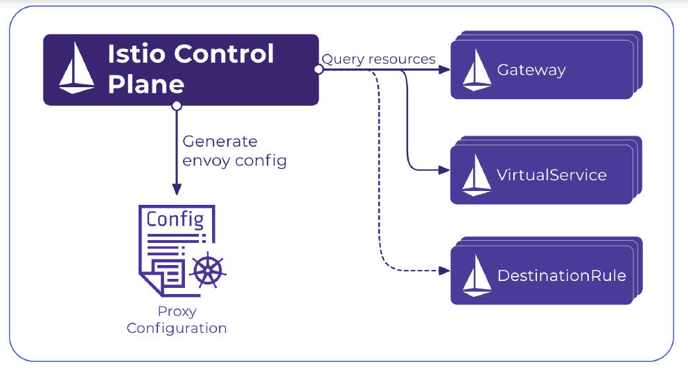
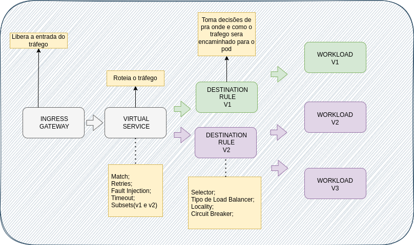

<h1 align="center">Istio</h1>

<p align="center">
  <a href="#instalação">Instalação</a>&nbsp;&nbsp;&nbsp;|&nbsp;&nbsp;&nbsp;
  <a href="#tráfego">Tráfego</a>&nbsp;&nbsp;&nbsp;|&nbsp;&nbsp;&nbsp;
  <a href="#componentes">Componentes</a>
</p>

<p align="center">
  
</p>

## Instalação

- [Documentação Instalação do Istio](https://istio.io/latest/docs/setup/getting-started/)
    - Download Istio
    - Instalação do Istio
        - OBS: Adicione um rótulo de namespace para instruir o Istio a injetar automaticamente proxies secundários do Envoy quando você implantar seu aplicativo posteriormente
            ```bash
            kubectl label namespace default istio-injection=enabled
            ```
    - [Configuração de Profiles](https://istio.io/latest/docs/setup/additional-setup/config-profiles/)
        - Exemplo:
            ```bash
            istioctl install --set profile=demo -y
            ```
- [Addons Instio](https://istio.io/latest/docs/ops/integrations/)
    - Dashboard visualização

- [Arquitetura Istio](https://istio.io/v1.4/docs/ops/deployment/architecture/)

## Tráfego

1. Conceitos básicos: 
    - Gateway
    - Virtual Service
    - Destination Rules
2. Criação de versões de deployments
3. Criação de Virtual Service e Destionation Rule
4. Práticas aplicando regras no `vs` e `dr`
    - Pesos de prioridades de requisição entre `subsets`
    - Tipos de Load Balancer
    - Consistent Hash
    - Fault Injection
    - Circuit Braker

## Componentes

1. Gateway
    - Ingress Gateway
    - Egress Gateway

- `Gateway` é um recurso usado para gerenciar o tráfego de entrada e saída dentro e fora da `malha de serviço`. Normalmente ele é configurado para permitir o tráfego de entrada de fontes de fora da malha.

- Esse componente recebe requisições de fora do Cluster, muito parecido com o `ingress do kubernetes`, porém o ingress do kubernetes tem funcionalidades que o tornam muito simples, já o `ingress do istio` ele trabalha no layer de 4 a 6, basicamente o que ele faz e deixar todas as requisições chegarem através de im ip na porta 80 e porta 443 por exemplo. Garante o gerenciamento de portas, host e TLS. 

- Ele não é responsável pelo roteamento do tráfego, não realiza esse tipo de rotemento de borda. Ele é conectado diretamente ao `virtual service` que já se responsabiliza pelo roteamento.

2. Virtual Service

- `Virtual Service` permite você configurar como as requisições são roteadas para um serviço. Ela possui uma série de regras que quando aplicadas farão com que as requisições sejam direcionadas ao destino correto.
    
    - Match - Roteamento de tráfego
    - Subsets
    - Fault Injection
    - Retries
    - Timeout

3. Destination Rules

- `Destination Rues` você pode pensar no Virtual Service como uma forma que você tem  para rotear o tráfego para um destino, então você utiliza as `destinations rules` para configurar o que acontece com o tráfego quando ele chega naquele destino.

    - Selector
    - Tipo de Loadbalancer
    - Locality
    - Circuit Break

<p align="center">
  
</p>