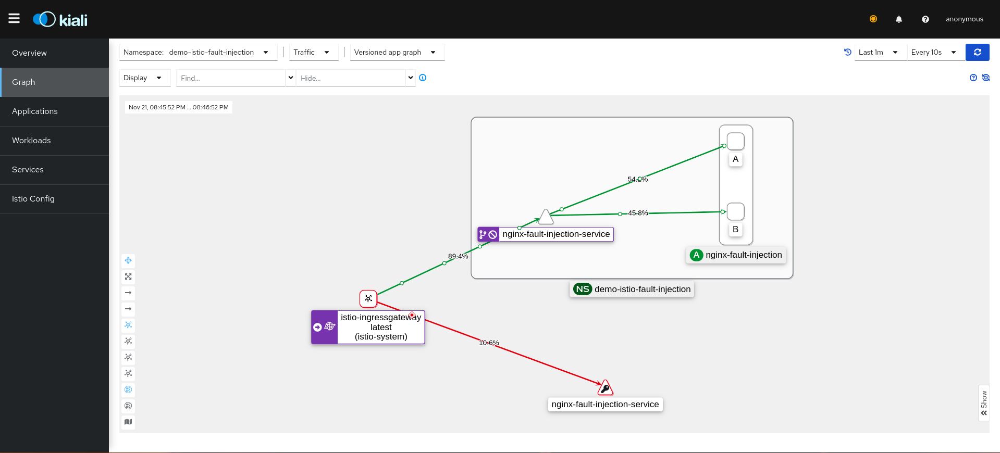

<h1 align="center">Praticando Gerenciamento de tráfego com o Istio</h1>- 

<p align="center">
  <a href="#weight">Weight</a>&nbsp;&nbsp;&nbsp;|&nbsp;&nbsp;&nbsp;
  <a href="#loadbalancer">Loadbalancer</a>&nbsp;&nbsp;&nbsp;|&nbsp;&nbsp;&nbsp;
 <a href="#consistent-hash">Consistent Hash</a>&nbsp;&nbsp;&nbsp;|&nbsp;&nbsp;&nbsp;
  <a href="#fault-injection">Fault Injection</a>&nbsp;&nbsp;&nbsp;|&nbsp;&nbsp;&nbsp;
  <a href="#circuit-breaker">Circuit Breaker</a>
</p>

<p align="center">

</p>

## Weight

- Prática: Pesos de prioridade nas requisições

    - [Deployments utilizado para a demonstração](/k8s/weight/Readme.md)

    - Acompanhamento do tráfego simulando pesos de prioridade nas requisições aos workloads através da dashboard no `Kiali`

    <p align="center">
        
    </p>

    - Virtual Service
        - O serviço virtual a seguir roteia as solicitações para diferentes versões de um serviço, onde um subset está configurado para receber 20% das requisições e o outro para receber 80%.

    ```yaml
    apiVersion: networking.istio.io/v1alpha3
    kind: VirtualService
    metadata:
    name: nginx-virtualservice
    namespace: demo-istio
    spec:
    gateways:
        - demo-istio/nginx-gateway
    hosts:
        - lab.k8s.io
    http:
        - match:
            - uri:
                prefix: /
        route:
            - destination:
                host: nginx-service.demo-istio.svc.cluster.local
                subset: A
            weight: 20
            - destination:
                host: nginx-service.demo-istio.svc.cluster.local
                subset: B
            weight: 80
    ```

    - Destination Rule

    ```yaml
    apiVersion: networking.istio.io/v1alpha3
    kind: DestinationRule
    metadata:
    name: nginx-destination-rule
    namespace: demo-istio
    spec:
    host: nginx-service.demo-istio.svc.cluster.local
    subsets:
        - labels:
            version: A
        name: A
        - labels:
            version: B
        name: B
    ```

    - Requisição: 

    ```bash
    while true; do sleep 0.5; curl http://lab.k8s.io; echo -e '\n'$(date);done
    ```

## Loadbalancer

- Prática: Tipos de Load Balancer

    - [Deployments utilizados na demonstração](/k8s/loadbalancer/Readme.md)

    - Utilizando o trafficPolicy para balancear requisições na minha `destination rule` e dentro da `subset`.

    - Virtual Srvice

    ```yaml
    apiVersion: networking.istio.io/v1alpha3
    kind: VirtualService
    metadata:
    name: nginx-lb-virtualservice
    namespace: demo-istio-lb
    spec:
    gateways:
        - demo-istio-lb/nginx-lb-gateway
    hosts:
        - lab.k8s.io
    http:
        - match:
            - uri:
                prefix: /
        route:
            - destination:
                host: nginx-lb-service.demo-istio-lb.svc.cluster.local
                subset: v1
            weight: 90
            - destination:
                host: nginx-lb-service.demo-istio-lb.svc.cluster.local
                subset: v2
            weight: 10
    ```

    - Destination Rule

    ```yaml
    apiVersion: networking.istio.io/v1alpha3
    kind: DestinationRule
    metadata:
    name: nginx-lb-destination-rule
    namespace: demo-istio-lb
    spec:
    host: nginx-lb-service.demo-istio-lb.svc.cluster.local
    trafficPolicy:
        loadBalancer:
        simple: ROUND_ROBIN
    subsets:
        - name: v1
        labels:
            version: A
        trafficPolicy:
            loadBalancer:
            simple: LEAST_CONN
        - name: v2    
        labels:
            version: B   
    ```

    - Tpos de algoritmos: 
        - `ROUND_ROBIN`: Algoritmo padrão utilizado, mantém a mesma quantidade de requisições entre os pods.
        - `LEAST_CONN`: Direciona sempre para o pod que recebeu menos requisição.
        - `RANDON`: Manda requisição de forma aleatória

    - Requisição: 

    ```bash
    while true; do sleep 0.5; curl http://lab.k8s.io/lb; echo -e '\n'$(date);done
    ```
    <p align="center">
    
    </p>


## Consistent Hash

- Prática: Consistent Hash

    - Conceito interessante que o `istio` tem que pode ajudar a fazer testes, algumas provas de conceito com versões diferentes que podemos querer colocar por exemplo em produção.

    - Situação problema:
    ```console
    - Imaginando que temos uma applicação xpto com duas versões, v1 e v2. No app de versão:v1 aparece uma logo de cor verde e na versão:v2 aparece uma logo de cor amarela, imaginando que ao acessar a aplicação eu chego na versão:v1 aparecendo a logo verde, porém logo em seguida quand for dado um refresh, serei encaminhado para a versão:v2 dando de cara com uma logo de cor amarela, e dessa forma sempre que tiver um refresh serei mandado para app de versões diferentes tendo a logo trocando de cor sempre. 

    - Baseado nisso, como fazer com que um usuário uma vez que ele acesse por exemplo a versão:v1, todas as outras vezes ele consiga sempre chegar somente na versão:v1 não sendo mais direcionado para a versão:v2
    ```

    - Um recurso conhecido para resolver esse problema é o Stick Session, uma sessão que pode se dizer que fica grudada no loadbalancer para ele saber para qual lado mandar determinada requisição.

    - O Istio ele tem um esquema para que se possa fazer algo parecido com isso, ele não tem necessariamente uma Stick Session embutida, mas sim um recurso chamado `consistent hash`.

    - Virtual Service

    ```yaml
    apiVersion: networking.istio.io/v1alpha3
    kind: VirtualService
    metadata:
    name: nginx-hash-virtualservice
    namespace: demo-istio-hash
    spec:
    gateways:
        - demo-istio-hash/nginx-hash-gateway
    hosts:
        - lab.k8s.io
    http:
        - match:
            - uri:
                prefix: /hash
        route:
            - destination:
                host: nginx-hash-service.demo-istio-hash.svc.cluster.local
                subset: all
    ```

    - Destination Rule

    ```yaml
    apiVersion: networking.istio.io/v1alpha3
    kind: DestinationRule
    metadata:
    name: nginx-hash-destination-rule
    namespace: demo-istio-hash
    spec:
    host: nginx-hash-service.demo-istio-hash.svc.cluster.local
    trafficPolicy:
        loadBalancer:
        consistentHash:
            httpHeaderName: "x-user"
    subsets:
        - name: all
        labels:
            app: nginx-hash
    ```

    - Requisição normal: 
    ```bash
    while true; do sleep 0.1; curl http://lab.k8s.io/hash; echo -e '\n'$(date);done
    ```

    <p align="center">
    
    </p>

    - Requisição passando o x-user: 
    ```bash
    while true; do sleep 0.1; curl --header "x-user:leo" http://lab.k8s.io/hash; echo -e '\n'$(date);done
    ```

    <p align="center">
    
    </p>

## Fault Injection

- Prática: Fault Injection

    - Colocar uma injeção de falha para simular problemas no sitema

    <p align="center">
    
    </p>

## Circuit Breaker

- Prática: Circuit Braker

    - Estudar