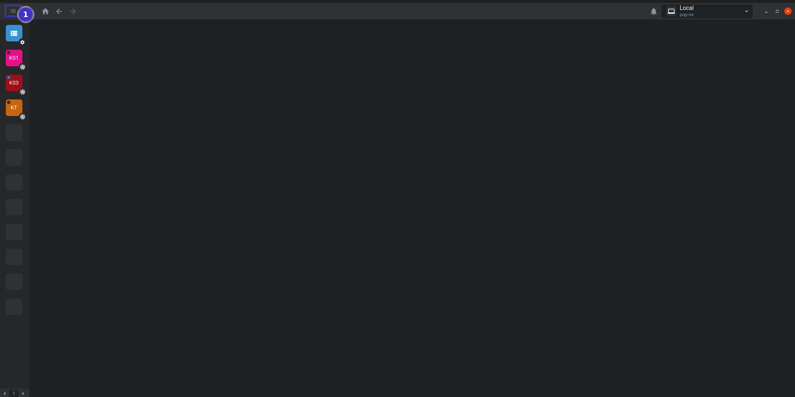
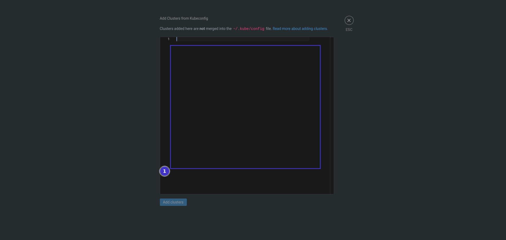
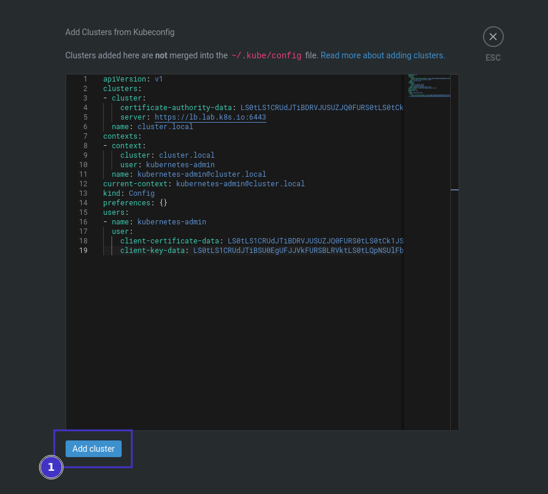
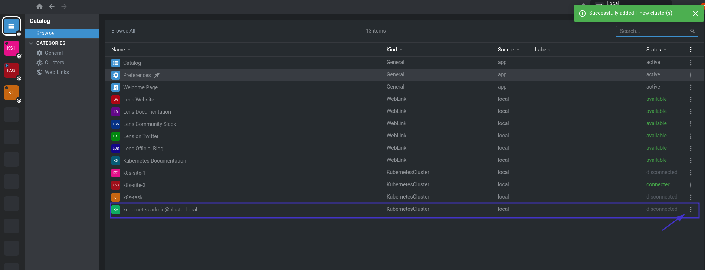
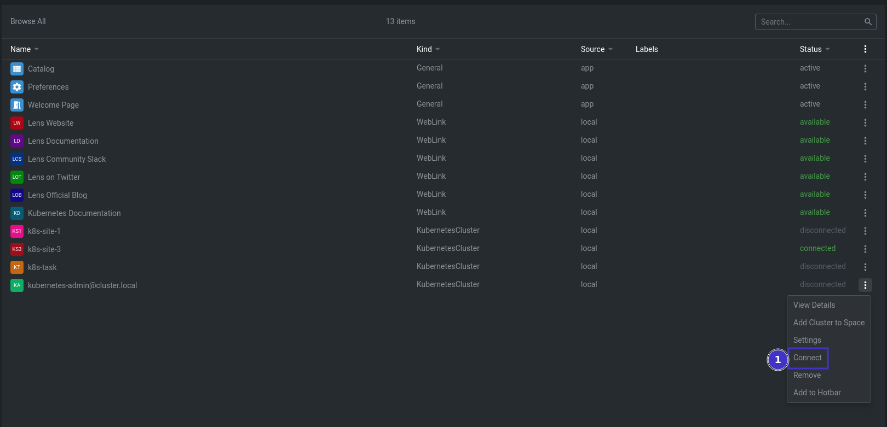
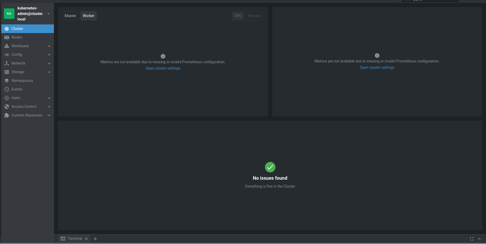
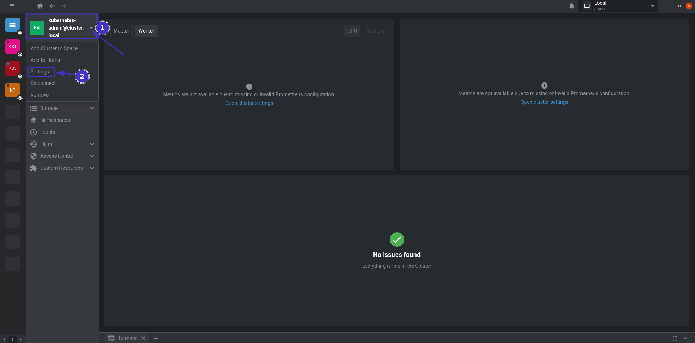
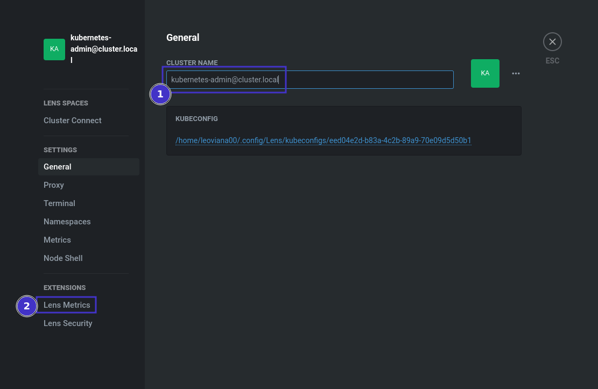
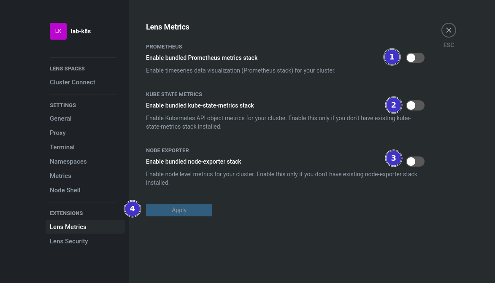
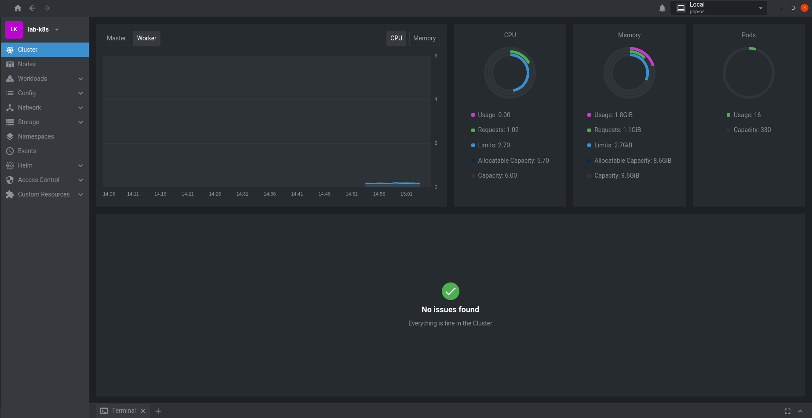

<h1 align="center">Kubernetes </h1>

<p align="center">
  
</p>

## Configurações

1. Configurações iniciais do cluster
  - [ Acessar VM - Master](/vagrant/Readme.md)
  - Configurar o `kubectl`

    ```bash
    mkdir -p $HOME/.kube
    sudo cp -i /etc/kubernetes/admin.conf $HOME/.kube/config
    sudo chown $(id -u):$(id -g) $HOME/.kube/config
    ```
2. Dashboard com lens
  - [ Acessar VM - Master](/vagrant/Readme.md)
  - Copiar o admin.conf

    ```bash
    sudo cat /etc/kubernetes/admin.conf
    ```
  - [Ter o lens instalado](https://k8slens.dev/)
  - Copiar o arquivo admin.conf para o lens

    - Abra o lens, `files` -> `add clster`

    <p align="center">
      
    </p>

    - Cole o conteúdo do `admin.conf` dentro do campo vazio:

    <p align="center">
      
    </p>
    
    - Adicione o novo cluster:

    <p align="center">
      
    </p>

    - Listando os cluster no lens:

    <p align="center">
      
    </p>

    - Conectando ao cluster:

    <p align="center">
      
    </p>

    - Dashboard `lens`:

    <p align="center">
      
    </p>

    - Acessando as configurações do cluster adicionado:

    <p align="center">
      
    </p>

    - Renomeando cluster adicionado:

    <p align="center">
      
    </p>

    - Ativando as métricas do lens:

    <p align="center">
      
    </p>
    
    - Dashboard lens com as métricas ativas:

    <p align="center">
      
    </p>
    


## Deployments file

1. weight
    - Aplicando regras de prioridade de requisição utilizando `vs` e `dr`
    
2. loadbalancer
    - Aplicando regras de traffic policy - `loadbalancer` na `dr` e `subsets`

